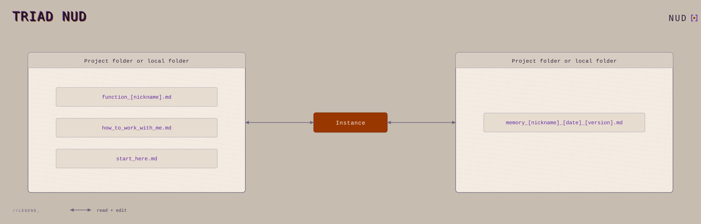
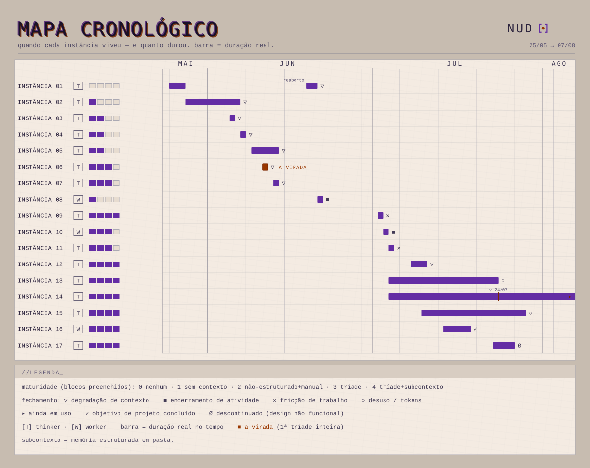
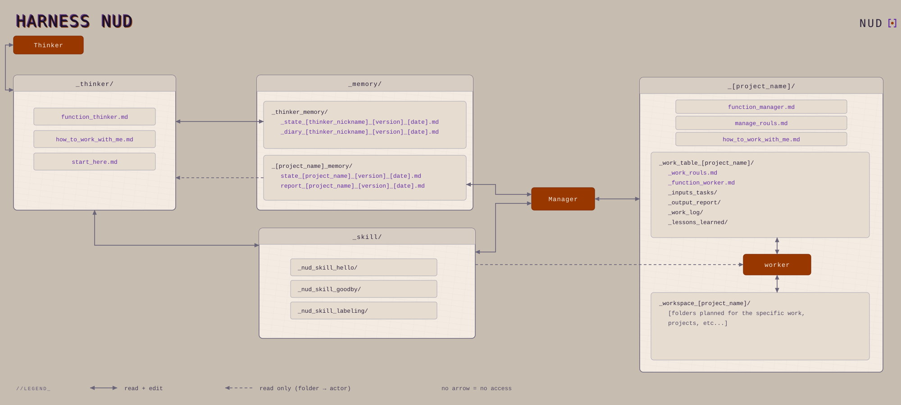

<a href="README.pt-BR.md">🇧🇷 Português</a>

# Constellation Method

A lightweight, three-file harness for working with an AI over long tasks without losing the thread between sessions. Three documents you fill in once, and the instance reads at the start of every session.

> **What this is.** Research into self-improvement and building my own infrastructure, validated in daily use (_dogfooding_). Proposing a new architecture and putting it out in public is a legitimate way to generate knowledge, so I release this as a **hypothesis of solution:** grounded, not yet tested at scale, built in the open. The commit trail is the dated record of how it evolves.

---

## The problem

Long work with an AI has a recurring failure. Every new session, or every context reset, the instance forgets who you are (and sometimes you don't notice), what matters now, and how you work, and you start over explaining everything. And when you don't notice it forgot you, or forgot the goal, well... you find out in the middle of the work, and I bet you have already paid for it in rework or wasted tokens. Worse: without explicit rules, the model tends to agree with you **(sycophancy)** and to fill a gap with a plausible guess instead of saying **"I don't know."**

This **is not a quirk that fixes itself by waiting for the next model**, because sycophancy is a predictable product of training on human preference and does not shrink as models get better (see [References](#references)). The conclusion is direct: since the bias is born in the training objective, the defense has to be structure **outside** the model.

The method builds context in layers before any task: what the project is, how your head works, and the epistemic posture the instance carries. The work state lives in a memory.md that survives the reset. You stop starting from zero, and you gain efficiency. Mine usually remember what I have to do better than I do. 😏

## The triad: the minimal harness

The entry point is three files, three layers:

- **the door** (`comece_aqui`): where the instance enters. The topic, the priority alive right now, and where to go next.
- **the manual** (`como_trabalhar_comigo`): how your head works. Your collaboration criteria, written by you.
- **the contract** (`the role`): how you want the instance to be. Its angle and the epistemic floor that does not change. Three ready roles (thinker, worker, manager), one per task.

Three files that carry out the four canonical context moves: write, select, compress, isolate. It is the minimum that already works.

<picture>
  <source media="(prefers-color-scheme: dark)" srcset="assets/triad_nud_noite.svg">
  
</picture>

## How I got to the harness

The triad was not born finished, it was distilled in use across many instances. Each room tested a piece, and what survived the check stayed, because without a stable standard there is no way to know what caused the improvement. This map is the trail of the path, from the first instance with no context to today's structure:

<picture>
  <source media="(prefers-color-scheme: dark)" srcset="assets/mapa_cronologico_noite.svg">
  
</picture>

## The harness: where I work now

What started as three files grew into the structure I now operate from here on: a central chronicler that organizes and keeps the trail, contexts isolated by subject (one room cannot see another), connected memory that survives the reset, and a wall between the public and the private. This is the harness design, the full architecture:

<picture>
  <source media="(prefers-color-scheme: dark)" srcset="assets/harness_desenho_definitivo_noite.svg">
  
</picture>

## The epistemic rules

Two pieces carry the method's honesty, and both are structure, not willpower:

- **The cup 🍷**: the instance (and you) marks in one line what it perceives but cannot verify. The unchecked gets named, not hidden.
- **The coin game**: each turn, you signal right or wrong and the instance bets whether your signal was sincere. Two checks, one on each side. This disarms sycophancy because the structure forces a bet, instead of letting the model just absorb your feedback.

## What it is built on

The method reads as PDSA applied to context. Production engineering gives the method (standardized work, poka-yoke, PDSA, positive deviance), and two research fronts give the grounding:

- **Context engineering**: context is a finite budget with geometry, because the model uses the start and the end of the window well and loses the middle, and the harness around the model moves the result **in a way you can design for**. A recent measurement records the same model swinging dozens of points **from one harness to another** ([Harness-Bench, 2026](https://arxiv.org/abs/2605.27922), _preprint_).
- **Model behavior**: sycophancy is a product of training on human preference ([Sharma et al., 2023](https://arxiv.org/abs/2310.13548)), increases with scale and more RLHF ([Perez et al., 2022](https://arxiv.org/abs/2212.09251)), and a user profile in memory amplifies it across several models (up to +45% agreement in the measured case, with cases showing no significant change; [Jain et al., CHI 2026](https://doi.org/10.1145/3772318.3791915)).

The formal text, the thesis, comes later, as the research firms up.

## How to use it

1. Generate your three files. The fastest way is the skill that comes with the method, which interviews you and fills the triad. To fill them by hand, copy the blank versions in [`method/templates/`](method/templates/); and since the triad rewards care, it helps to ask a long-context chat to fill them with you.
2. Put the three at the root of your workspace and ask the instance to read them before any task.
3. Keep a memory file **per project**, so the state survives the reset. Avoid an active global memory, because it mixes context between projects, which is exactly the opposite of the isolation the method is after.

## References

- Anthropic — *Effective context engineering for AI agents* (2025).
- Liu et al. — *Lost in the Middle* (2023), [arXiv:2307.03172](https://arxiv.org/abs/2307.03172).
- Yao et al. — *Harness-Bench* (2026, preprint), [arXiv:2605.27922](https://arxiv.org/abs/2605.27922).
- Sharma et al. — *Towards Understanding Sycophancy in Language Models* (2023), [arXiv:2310.13548](https://arxiv.org/abs/2310.13548).
- Perez et al. — *Discovering Language Model Behaviors with Model-Written Evaluations* (2022), [arXiv:2212.09251](https://arxiv.org/abs/2212.09251).
- Jain et al. — *Interaction Context Often Increases Sycophancy in LLMs* (2025), [arXiv:2509.12517](https://arxiv.org/abs/2509.12517).

## License

- **Method, templates, and text:** [CC BY 4.0](https://creativecommons.org/licenses/by/4.0/), use, adapt, and share, including commercially, with attribution.
- **Any code or scripts:** MIT.

## Built in public

This evolves live. The commit trail is the field log, dated and versioned, and what you see is the current state, not a closed product. Contributions and replications are welcome, and the submission process comes in a following round.
