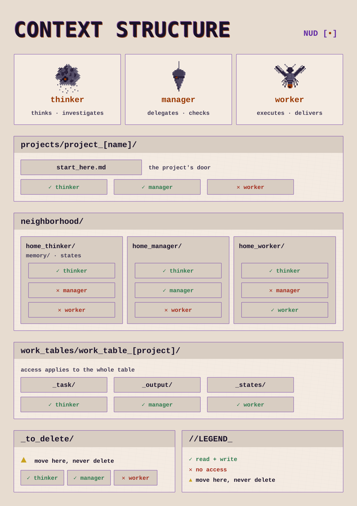

<p align="right"><a href="README.md">🇺🇸 English</a></p>

# Método Constelação

Método de gerenciar várias áreas e projetos a partir de um contexto mínimo que direciona tudo, com agentes em três ângulos de função.

---

## O que é

É um jeito de organizar contexto para que a IA consiga me ajudar a gerenciar a minha vida. Comecei simples: arquivos markdown dentro de projetos na interface do provedor, que a instância lia no início de cada trabalho. Fui documentando aqui conforme escalava. Hoje tenho um sistema que funciona em qualquer modelo, provedor ou interface, e gerencio toda a minha vida a partir de três funções de agente: thinker, manager e worker. Isso está transformando a minha vida. Me dá mais autonomia e capacidade de criação, e me deixou uma pessoa mais saudável.

Ainda tenho muito pra melhorar e aprender, por isso as melhorias vão sempre chegar a este repositório. Aqui explico como instalar e começar a usar os meus agentes e o meu método de fluxo de contexto para o que você quiser: gerenciar uma vida, um projeto, ou uma demanda chata do seu trabalho.

## Contexto mínimo

Tudo parte de um contexto mínimo, dividido em três documentos. Cada um organiza um tipo de informação que a instância precisa para trabalhar de forma gerencial. Se você quer usar só num projeto pontual, e não é desenvolvedor, use um projeto no app do seu provedor (o Claude Cowork, por exemplo): os três documentos entram na configuração do projeto, e pronto. É simples e funcional. **Para escalar, com gerenciamento e memória continuada**, esses mesmos três documentos são o mínimo que a plataforma precisa para configurar um agente: o manual vira as regras de conduta, a porta vira a memória do projeto, e a função vira o perfil do agente. Os guardrails (o que ele não pode executar, onde não pode escrever) e os hooks (o que é barrado antes de acontecer) entram por cima disso, como configuração da plataforma, não como texto. Onde cada peça mora em cada plataforma está em [`ONDE_CONFIGURAR.md`](ONDE_CONFIGURAR.md).

Três documentos, três camadas:

- **a porta** (`start_here`): onde a instância entra. O tema, o objetivo, o porquê aquilo importa agora = contextualização do objetivo;
- **o manual** (`how_to_work_with_me`): como a sua cabeça funciona. Os seus critérios de colaboração = contextualização da comunicação humano/IA;
- **a função** (`agents/`), **thinker**/**manager**/**worker**, ou análise/auditoria/execução = contextualização do que é indispensável para o cumprimento do objetivo.

## Agentes

Num trabalho pequeno, dentro de um projeto do app, a tarefa é pontual: ou é análise, ou é conferência, ou é execução. Você escolhe um agente e usa só ele. Para gerenciar, os três trabalham em camadas no mesmo projeto, e o que chega até você é só o resultado, pronto para a decisão. O que me deixa confiante para deixar os agentes gerenciando é o piso que cada um carrega: eu trabalho com muita análise de dado e pesquisa, preciso de camadas de conferência, e eles funcionam exatamente assim:

- **Execução operacionalizada** (worker): executa a tarefa sem o viés de quem desenhou o processo.
- **Conferência auditiva** (manager): confere o que voltou contra o que foi combinado.
- **Conferência analítica** (thinker): estressa a hipótese antes de ela virar decisão, e planeja o próximo.

O piso e os guardrails que os três carregam estão explicados em [`METODO.md`](METODO.md).

## Como usar

1. **Baixe as skills.** Estão na pasta [`skills/`](skills/): cada uma como pasta aberta e como `.zip` pronto para subir no seu app. O `README` da pasta explica a instalação.
2. **`nud-como-trabalhar-comigo`** — instale ou cole no chat. A instância vai fazer perguntas; responda com sinceridade. Esse documento é o que estabelece o chão comum de comunicação entre você e seus agentes.
3. **`nud-comece-aqui`** — te ajuda a explicar seu objetivo. Serve para pasta de projeto, demanda pontual ou objetivo específico (uma festa de casamento, por exemplo). Garante o contexto mínimo de um objetivo.
4. **`nud-agentes`** — o contexto do método. Instala na instância a capacidade de te ajudar a montar o seu jeito de trabalhar, seja num projeto do app ou em escala, e traz os perfis dos três agentes dentro. Ela vai pedir os dois documentos gerados acima para entender que tipo de configuração você precisa.

**Exemplo no Claude Cowork (setembro de 2026):** o manual vai em *Configurações → Geral → Instruções para o Claude* (vale para todas as conversas) ou nas *Instruções* do projeto; a porta vai nas *Instruções* do projeto, e o objetivo também pode ir para a memória do projeto (a pasta `claude`, que a instância cria quando você pede e que só aparece na interface depois que tem algo dentro); o perfil do agente vai em *Configurações → Cowork* (as instruções que valem para todas as sessões do Cowork) ou nas *Instruções* do projeto. Os nomes dos campos mudam com o tempo; a lógica se mantém: manual = como você trabalha, porta = o que é o projeto, função = o papel da instância.

<picture>
  <source media="(prefers-color-scheme: dark)" srcset="assets/context-structure-night.svg">
  
</picture>

## Onde usar

O contexto mínimo cabe numa pasta só, dentro do projeto do seu app. O contexto em escala precisa de uma estrutura de pastas no seu computador. Depois de montada, ela não se move nem se apaga, só cresce: as configurações e os guardrails apontam para esses caminhos. É isso que mantém a instância sempre calibrada no contexto e capaz de gerenciar os temas.

```
Documents/
└── vault_[name]/
    ├── _to_delete/                 ← pré-lixeira: nada é apagado de vez
    ├── projects/
    │   └── project_[name]/
    │       └── start_here.md       ← a porta do projeto
    ├── neighborhood/               ← uma casa por agente
    │   ├── home_thinker/
    │   │   └── memory/             ← estados
    │   ├── home_manager/
    │   └── home_worker/
    └── work_tables/
        └── work_table_[project]/   ← handoff entre agentes
            ├── _task/
            ├── _output/
            └── _states/
```

O que cada peça faz: a **casa** (`home_[agent]`) é onde cada agente é vinculado, e em alguns serviços a pasta se liga ao identificador do agente; a **work_table** é onde um agente entrega e outro pega; a **memory** guarda estados de onde o trabalho parou; a **pré-lixeira** evita exclusão e permite recuperar; e o `start_here.md` fica na pasta do projeto.

## Para se aprofundar

- [`METODO.md`](METODO.md): o piso epistêmico, os guardrails, as duas regras da honestidade, em que degrau o método está e em que ele se apoia.
- [`ONDE_CONFIGURAR.md`](ONDE_CONFIGURAR.md): onde cada camada mora em cada plataforma (Claude Code, Hermes, Codex).
- [`MANIFESTO.pt-BR.md`](MANIFESTO.pt-BR.md): de onde isso veio.
- [`cronologia/`](cronologia/): a trilha do método, por eras.
- [`DEVLOG.md`](DEVLOG.md): o que mudou, quando, e o que a conferência derrubou.

## Licença

- **Método, templates e textos:** [CC BY 4.0](https://creativecommons.org/licenses/by/4.0/)
- **Qualquer código ou script:** MIT.
