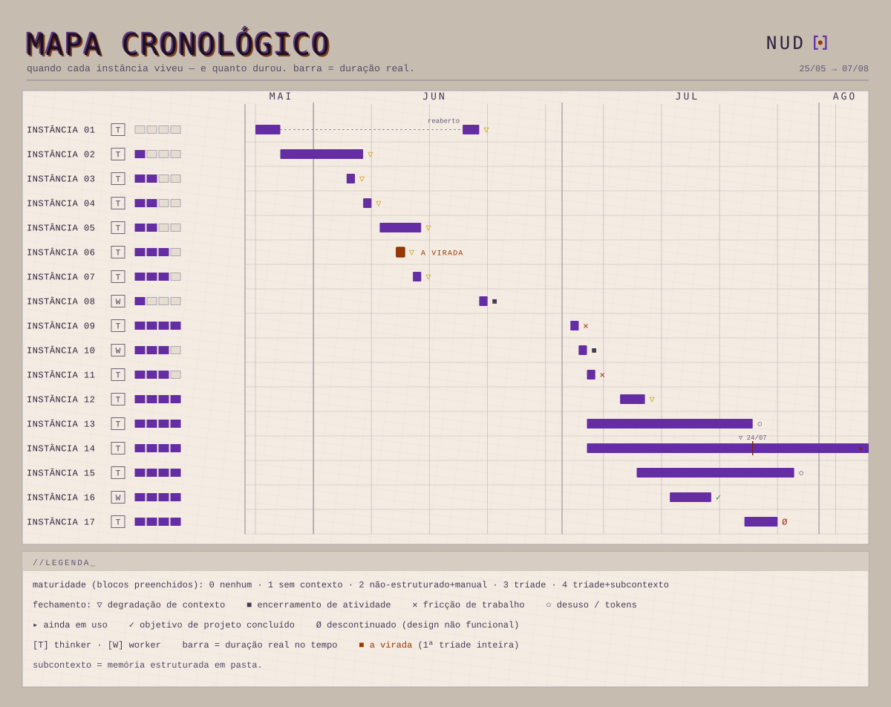

# Cronologia

A trilha do método, por eras. Cada era vai até o ponto em que a forma de trabalhar deixou de dar conta e pediu outra escala.

## Era 1 — A Tríade

<picture>
  <source media="(prefers-color-scheme: dark)" srcset="assets/mapa_cronologico_noite_farol.svg">
  
</picture>

Da primeira instância sem contexto nenhum até a Tríade formalizada e em uso diário. O mapa mostra quando cada instância viveu e quanto durou (a barra é a duração real no tempo), e o quanto de contexto cada uma carregava (os blocos preenchidos, de 0 a 4).

A virada é a instância 06, a primeira vez que a Tríade inteira rodou junta. A era fecha quando o trabalho passou a pedir escala, o que abre a próxima.

A Era 1 marca como o método foi construído, e a partir da instância 12 marca o início do uso da tríade, o método de contexto mínimo em uma pasta de trabalho/projeto. 
