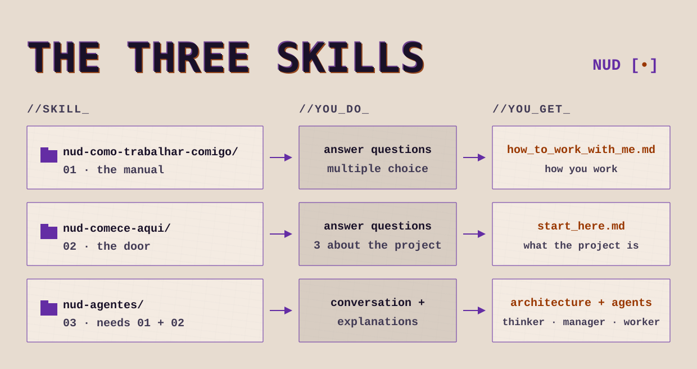

# As três skills

<picture>
  <source media="(prefers-color-scheme: dark)" srcset="assets/skills-overview-night.svg">
  
</picture>

Três skills, uma por documento do contexto mínimo. Use nesta ordem:

1. **`nud-como-trabalhar-comigo`**: o manual. A instância te entrevista e entrega o `how_to_work_with_me.md`: como a sua cabeça funciona, para os agentes trabalharem do seu jeito.
2. **`nud-comece-aqui`**: a porta. Três perguntas sobre o projeto e entrega o `start_here.md`: o que é, o objetivo, e por que importa agora.
3. **`nud-agentes`**: a função e o guia de montagem. Carrega o contexto do método, pede os dois documentos acima, entrega os três perfis de agente (thinker, manager, worker) e monta o seu ambiente com você, num projeto do app ou em escala.

## Instalar

Copie a pasta da skill inteira para o diretório de skills da sua instância (por exemplo, `.claude/skills/` no Claude Code) ou instale pela interface do seu app. Cada skill é lida a partir do `SKILL.md` dela; as subpastas (`modelos/`, `regras/`, `contexto/`) fazem parte, não apague.

Se o seu app aceita skill em arquivo `.zip`, cada pasta tem o seu zip ao lado, pronto para subir: `nud-como-trabalhar-comigo.zip`, `nud-comece-aqui.zip`, `nud-agentes.zip`.

*Manutenção (para quem edita o repositório): depois de mudar qualquer skill, rode `python skills/build_zips.py` para regenerar os três zips.*

Licença: CC-BY-4.0 · Thainá Ramos (Nud by Whatevertr).
